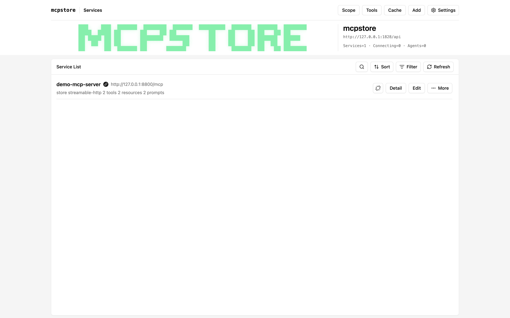
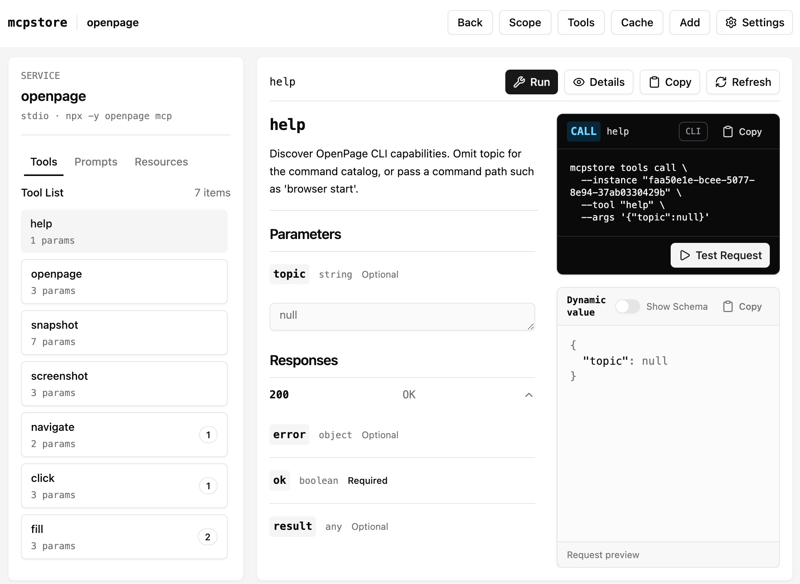
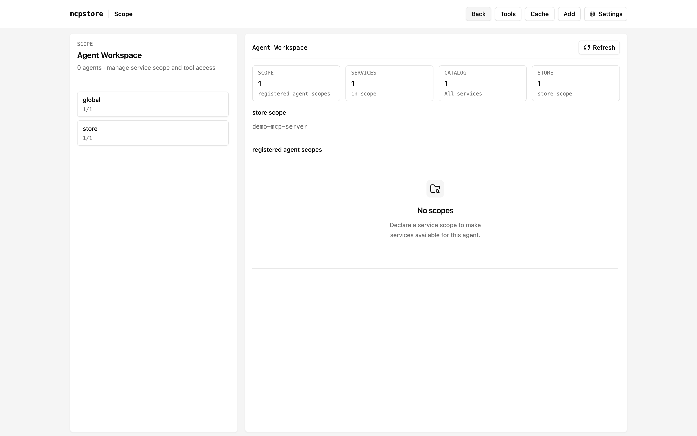
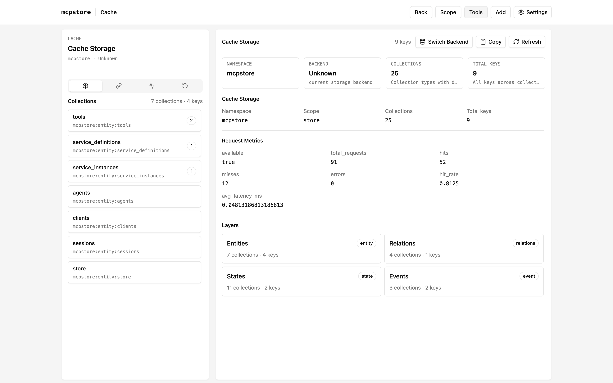

<h4 align="right">
  <a href="README_en.md">English</a> | <strong>简体中文</strong>
</h4>

<h1 align="center">mcpstore</h1>

<p align="center">
  <strong>基于 Rust 构建的 MCP 管理</strong><br>
</p>

<p align="center">
  <a href="https://github.com/ip2a/mcpstore/releases/latest"></a>
  <a href="https://github.com/ip2a/mcpstore/stargazers"></a>
  <a href="https://github.com/ip2a/mcpstore/network/members"></a>
  
</p>

<p align="center">
  <a href="https://github.com/ip2a/mcpstore/releases/latest">
    
  </a>
  <a href="https://github.com/ip2a/mcpstore/releases/latest">
    
  </a>
  <a href="https://github.com/ip2a/mcpstore/releases/latest">
    
  </a>
</p>

## 为什么使用 mcpstore

一套入口覆盖 App、CLI 与 SDK，按 Agent 隔离作用域，并能一键适配 LangChain、OpenAI、CrewAI 等框架；基于 Rust 内核，安装即用，本地与多进程共享都行。

## 快速开始

```bash
curl -fsSL https://raw.githubusercontent.com/ip2a/mcpstore/main/install.sh | bash
```

or npm

```bash
npm install -g mcpstore
```

想用代码集成？→ [通过 SDK 使用](#sdk-使用)


## 桌面应用（Beta）

提供图形界面，统一管理 MCP 服务、工具、作用域与缓存。当前为 Beta，可从 [GitHub Releases](https://github.com/ip2a/mcpstore/releases/latest) 下载安装包：

<p align="center">
  <a href="https://github.com/ip2a/mcpstore/releases/latest">
    
  </a>
  <a href="https://github.com/ip2a/mcpstore/releases/latest">
    
  </a>
  <a href="https://github.com/ip2a/mcpstore/releases/latest">
    
  </a>
</p>


### 服务列表

统一查看和管理 MCP 服务：连接状态、健康度、工具 / 资源 / Prompt 数量一目了然，支持搜索、排序与筛选。

<p align="center">
  
</p>

### 工具

浏览服务暴露的全部工具，查看参数与响应结构，并可直接在界面中试跑调用。

<p align="center">
  
</p>

### 作用域

为不同 Agent 划分服务与工具的可见范围，store 与 agent 作用域独立管理。

<p align="center">
  
</p>

### 缓存

查看 KV 存储中的命名空间、集合与请求指标，掌握数据分布与命中情况。

<p align="center">
  
</p>

## CLI 使用

通过 CLI 管理 MCP 服务、查看运行状态，并为 Agent 提供命令行工作流。

## SDK 使用

通过 Python SDK 或 Rust Lib 将 mcpstore 集成到自己的应用中。点击下方展开对应语言的安装与示例。

<details>
<summary><strong>Python</strong></summary>

### 安装

```bash
pip install mcpstore
```

### 简单示例

初始化 `store`：

```python
from mcpstore import MCPStore

store = MCPStore.setup_store()
```

通过 `store.for_store()` 管理全局作用域内的 MCP 服务和工具。

#### 添加第一个服务

```python
store.for_store().add_service({
    "mcpServers": {
        "mcpstore_wiki": {
            "url": "https://example.com/mcp"
        }
    }
}).wait_service("mcpstore_wiki")
```

`add_service` 接受 MCP 服务配置；`wait_service` 等待指定服务就绪。

#### 转换为 LangChain 工具

```python
tools = store.for_store().for_langchain().list_tools()
print("loaded langchain tools:", len(tools))
```

适配器从 `store.for_store()` 读取工具，并转换为对应框架使用的对象。

| 框架 | 获取工具 |
| --- | --- |
| LangChain | `tools = store.for_store().for_langchain().list_tools()` |
| LangGraph | `tools = store.for_store().for_langgraph().list_tools()` |
| OpenAI | `tools = store.for_store().for_openai().list_tools()` |
| AutoGen | `tools = store.for_store().for_autogen().list_tools()` |
| CrewAI | `tools = store.for_store().for_crewai().list_tools()` |
| LlamaIndex | `tools = store.for_store().for_llamaindex().list_tools()` |
| Semantic Kernel | `tools = store.for_store().for_semantic_kernel().list_tools()` |

#### 在 LangChain 中使用

```python
from langchain.agents import create_agent
from langchain_openai import ChatOpenAI

llm = ChatOpenAI(
    temperature=0,
    model="your-model",
    api_key="sk-*****",
    base_url="https://api.xxx.com",
)
agent = create_agent(model=llm, tools=tools, system_prompt="你是一个助手")
events = agent.invoke({
    "messages": [{"role": "user", "content": "mcpstore 怎么添加服务？"}]
})
print(events)
```

这里的 `tools` 由 `store.for_store()` 提供。

#### 为 Agent 分组

使用 `for_agent(agent_id)` 为不同 Agent 建立独立作用域：

```python
store.for_agent("agent1").add_service({
    "name": "mcpstore_wiki",
    "url": "https://example.com/mcp",
})

store.for_agent("agent2").add_service({
    "name": "gitodo",
    "command": "uvx",
    "args": ["gitodo"],
})

agent1_tools = store.for_agent("agent1").list_tools()
agent2_tools = store.for_agent("agent2").list_tools()
```

`store.for_agent(agent_id)` 与 `store.for_store()` 提供相同的操作，服务和工具按 Agent 作用域隔离。

### 常用接口

| 动作 | 示例 |
| --- | --- |
| 添加服务 | `store.for_store().add_service(config)` |
| 定位服务 | `store.for_store().find_service("service_name")` |
| 查看服务信息 | `store.for_store().find_service("service_name").info()` |
| 查看服务状态 | `store.for_store().find_service("service_name").state()` |
| 更新服务 | `store.for_store().update_service("service_name", new_config)` |
| 增量更新 | `store.for_store().patch_service("service_name", updates)` |
| 等待就绪 | `store.for_store().wait_service("service_name", timeout=30)` |
| 重启服务 | `store.for_store().restart_service("service_name")` |
| 断开服务 | `store.for_store().disconnect_service("service_name")` |
| 删除服务 | `store.for_store().remove_service(service_name="service_name")` |
| 列出服务 | `store.for_store().list_services()` |
| 列出工具 | `store.for_store().list_tools()` |
| 列出当前作用域资源 | `store.for_store().list_resources()` |
| 列出当前作用域资源模板 | `store.for_store().list_resource_templates()` |
| 读取指定服务资源 | `store.for_store().find_service("service_name").read_resource("resource://uri")` |
| 列出当前作用域 Prompts | `store.for_store().list_prompts()` |
| 获取指定服务 Prompt | `store.for_store().find_service("service_name").get_prompt("prompt_name", {"k": "v"})` |
| 调用工具 | `store.for_store().find_tool("tool_name").call({"k": "v"})` |
| 查看配置 | `store.for_store().show_config()` |
| 列出 Agent | `store.list_agents()` |

</details>

<details>
<summary><strong>Rust</strong></summary>

### 安装

```bash
cargo add mcpstore
```

### 简单示例

初始化 `store` 并添加服务：

```rust
use std::time::Duration;

use mcpstore::{McpConfig, MCPStore, Result, ServiceTarget};

#[tokio::main]
async fn main() -> Result<()> {
    let store = MCPStore::setup(None)?;

    let config = McpConfig::from_json_str(
        r#"{
            "mcpServers": {
                "mcpstore_wiki": {
                    "url": "https://example.com/mcp"
                }
            }
        }"#,
    )?;

    store
        .for_store()
        .add_service(config)
        .await?
        .wait_service(
            ServiceTarget::ServiceName("mcpstore_wiki"),
            Duration::from_secs(30),
        )
        .await?;

    let tools = store.for_store().list_tools().await?;
    println!("loaded tools: {}", tools.len());
    Ok(())
}
```

#### 为 Agent 分组

```rust
use mcpstore::{McpConfig, MCPStore, Result};

#[tokio::main]
async fn main() -> Result<()> {
    let store = MCPStore::setup(None)?;

    store
        .for_agent("agent1")
        .add_service(McpConfig::from_json_str(
            r#"{"name":"mcpstore_wiki","url":"https://example.com/mcp"}"#,
        )?)
        .await?;

    store
        .for_agent("agent2")
        .add_service(McpConfig::from_json_str(
            r#"{"name":"gitodo","command":"uvx","args":["gitodo"]}"#,
        )?)
        .await?;

    let agent1_tools = store.for_agent("agent1").list_tools().await?;
    let agent2_tools = store.for_agent("agent2").list_tools().await?;
    println!(
        "agent1={}, agent2={}",
        agent1_tools.len(),
        agent2_tools.len()
    );
    Ok(())
}
```

`for_agent` 与 `for_store` 提供相同的操作，服务和工具按 Agent 作用域隔离。

### 暴露 HTTP API / MCP Server

需要对外提供服务时，使用 Rust CLI（Python SDK 不再启动嵌入式 API server）：

```bash
# 启动 Rust HTTP API
mcpstore api --config-path ./mcp.json --host 127.0.0.1 --port 1820

# 以 stdio 启动 Rust MCP Server
mcpstore mcp --config-path ./mcp.json

# 以 streamable-http 启动 Rust MCP Server
mcpstore mcp --config-path ./mcp.json --transport streamable-http --host 127.0.0.1 --port 1830 --path /mcp
```

### 常用接口

| 动作 | 示例 |
| --- | --- |
| 添加服务 | `store.for_store().add_service(config).await?` |
| 定位服务 | `store.for_store().find_service(ServiceTarget::ServiceName("name")).await?` |
| 等待就绪 | `store.for_store().wait_service(ServiceTarget::ServiceName("name"), timeout).await?` |
| 列出服务 | `store.for_store().list_services().await?` |
| 列出工具 | `store.for_store().list_tools().await?` |
| 调用工具 | `store.for_store().call_tool("tool_name", args).await?` |
| 查看配置 | `store.for_store().show_config().await?` |

</details>


## Star History

<div align="center">

[](https://star-history.com/#ip2a/mcpstore&Date)

</div>

---

欢迎通过 Issues 提交问题与建议。
