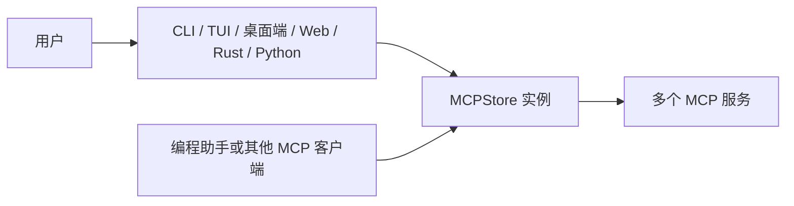

# 使用关系

MCPStore 的基本关系如下：

```mermaid
flowchart LR
    user[用户]
    entry[CLI / TUI / 桌面端 / Web / Rust / Python]
    store[MCPStore 实例]
    services[多个 MCP 服务]
    client[编程助手或其他 MCP 客户端]

    user --> entry
    entry --> store
    store --> services
    client --> store
```

## 本地实例

使用本机运行的 MCPStore，适合个人使用和本地开发。

## 远程实例

MCPStore 运行在服务器上，本地入口或其他设备连接它，适合集中管理。

## 代码集成

Rust 是核心能力的主要使用方式；Python 提供对应的门面。两种语言围绕相同的功能组织文档。
